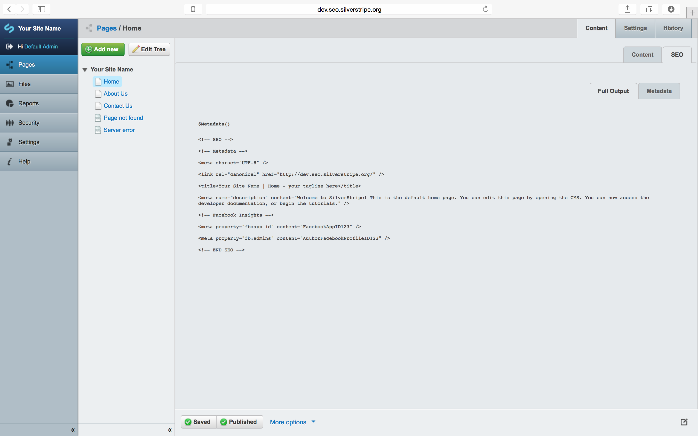
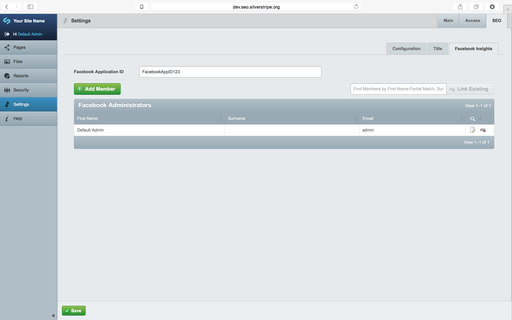
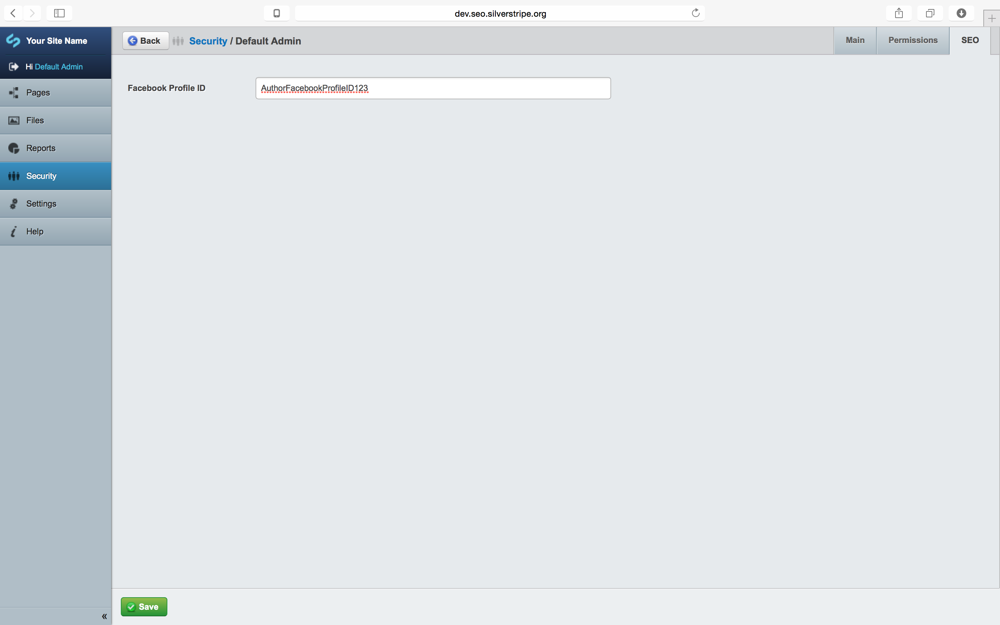

## Overview ##

This is a modular extension for [graphiques-digitale/silverstripe-seo-metadata](https://github.com/Graphiques-Digitale/silverstripe-seo-metadata)

It enables [Facebook Domain Insights](https://developers.facebook.com/docs/platforminsights/domains) i.e. `fb:app_id` and `fb:admins`

It requires:
* [`Metadata`](https://github.com/Graphiques-Digitale/silverstripe-seo-metadata)

It is intended to be used alongside it's siblings:
* [`Icons`](https://github.com/Graphiques-Digitale/silverstripe-seo-icons)
* [`Open Graph`](https://github.com/Graphiques-Digitale/silverstripe-seo-open-graph)
<!--* [`Twitter Cards`](https://github.com/Graphiques-Digitale/silverstripe-seo-twitter-cards)-->
<!--* [`Schema.org`](https://github.com/Graphiques-Digitale/silverstripe-seo-schema-dot-org)-->

These are all optional and fragmented from the alpha version [`SSSEO`](https://github.com/Graphiques-Digitale/SSSEO), which is now redundant.

## Installation ##

### Composer ###

* `composer require graphiques-digitale/silverstripe-seo-facebook-domain-insights`
* rebuild using `/dev/build/?flush`

### From ZIP ###

* Place the extracted folder `silverstripe-seo-facebook-domain-insights-{version}` into `silverstripe-seo-facebook-domain-insights` in the SilverStripe webroot
* rebuild using `/dev/build/?flush`

## CMS Usage ##

The Facebook App ID is set globally via `/admin/settings/` under the Metadata tab.

Facebook Admins are added by adding `Members`/users to the at the same location above.

Admin IDs are set against the actual users on their `/admin/security/` page.

## Template Usage ##

Depending on your configuration, the general idea is to replace all header content relating to metadata with `$Metadata()` just below the opening `<head>` tag and `$BaseHref()` function, e.g.:

```html
<head>
    <% base_tag %>
    $Metadata()
    <!-- further includes ~ viewport, etc. -->
</head>
```

This will output something along the lines of:

```html
<head>
    <base href="http://dev.seo.silverstripe.org/"><!--[if lte IE 6]></base><![endif]-->

    <!-- SEO -->
    <!-- Metadata -->
    <meta charset="UTF-8" />
    <link rel="canonical" href="http://dev.seo.silverstripe.org/" />
    <title>Your Site Name | Home - your tagline here</title>
    <meta name="description" content="Welcome to SilverStripe! This is the default home page. You can edit this page by opening the CMS. You can now access the developer documentation, or begin the tutorials." />
    <!-- Facebook Insights -->
    <meta property="fb:app_id" content="FacebookAppID123" />
    <meta property="fb:admins" content="AuthorFacebookProfileID123" />
    <!-- END SEO -->

    <!-- further includes ~ viewport, etc. -->
</head>
```

## Issue Tracker ##

Issues are tracked on GitHub @ [Issue Tracker](https://github.com/Graphiques-Digitale/silverstripe-seo-facebook-domain-insights/issues)

## Development and Contribution ##

Please get in touch @ [`hello@graphiquesdigitale.net`](mailto:hello@graphiquesdigitale.net) if you have any extertise in any of these SEO module's areas and would like to help ~ they're a lot to maintain.

## License ##

MIT License






[1]: https://www.iacquire.com/blog/18-meta-tags-every-webpage-should-have-in-2013
[2]: http://www.silverstripe.org/blog/5-tips-for-seo-with-silverstripe-3-/
[3]: http://moz.com/learn/seo/title-tag
[4]: https://github.com/audreyr/favicon-cheat-sheet
[5]: http://www.jonathantneal.com/blog/understand-the-favicon/
[6]: http://blogs.msdn.com/b/ie/archive/2012/06/08/high-quality-visuals-for-pinned-sites-in-windows-8.aspx
[7]: https://developers.facebook.com/docs/platforminsights/domains
[8]: http://ogp.me
[9]: https://dev.twitter.com/cards/overview
[10]: https://developers.google.com/+/web/snippet/
[11]: https://mathiasbynens.be/notes/touch-icons
